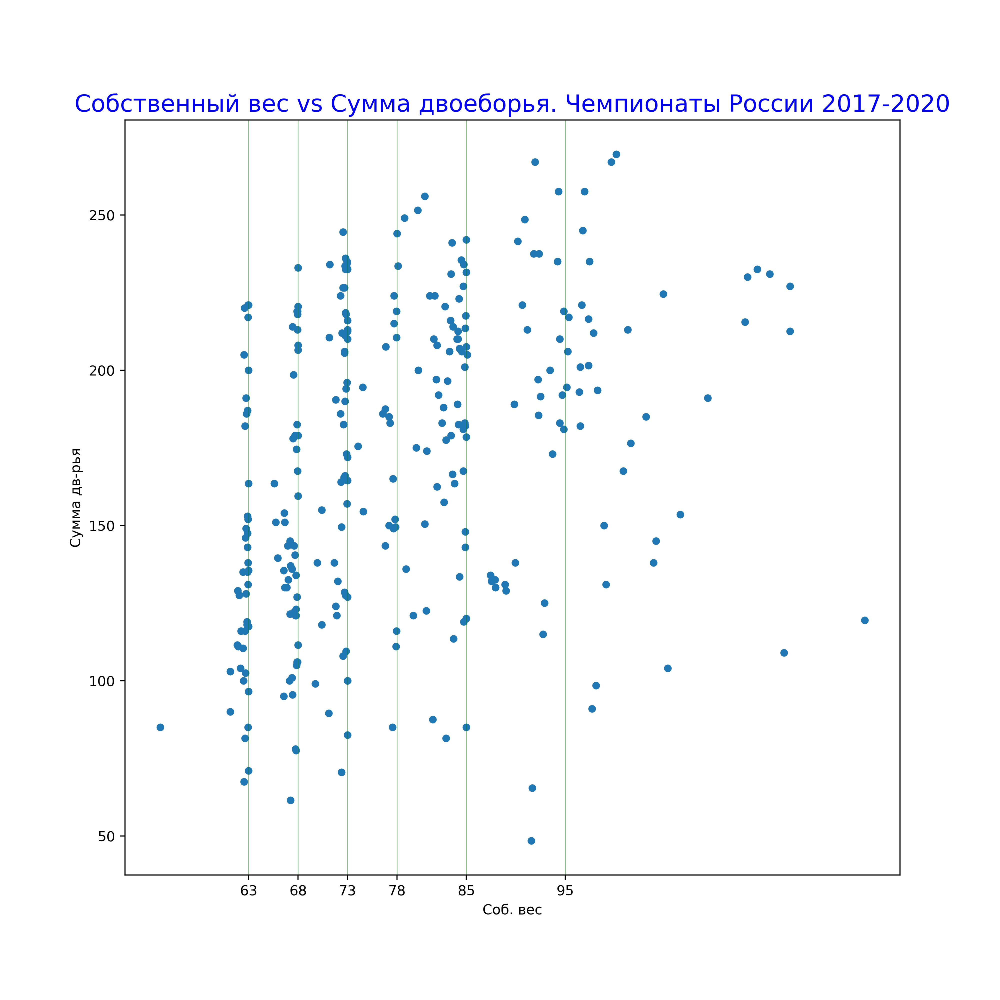

# Статистика гиревого спорта

Привет! Много холивара вокруг весовых категорий в гиревом спорте. Давайте попробуем посмотеть на это с разных углов, но в первую очередь - с точки зрения данных.
Здесь я анализирую данные результатов соревнований проводимых [ВФГС](https://ru.wikipedia.org/wiki/%D0%92%D1%81%D0%B5%D1%80%D0%BE%D1%81%D1%81%D0%B8%D0%B9%D1%81%D0%BA%D0%B0%D1%8F_%D1%84%D0%B5%D0%B4%D0%B5%D1%80%D0%B0%D1%86%D0%B8%D1%8F_%D0%B3%D0%B8%D1%80%D0%B5%D0%B2%D0%BE%D0%B3%D0%BE_%D1%81%D0%BF%D0%BE%D1%80%D1%82%D0%B0 "Всероссийская федерация гиревого спорта"). Все данные взяты из протоколов с [офциального сайта Федерации](https://vfgs.ru/docs/protokoly/ "vfgs.ru Протоколы соревнований").

## Поехали
В компьютеро читаемом формате на момент написания этого материала были доступны 

