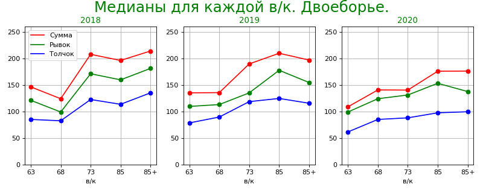

[вернуться на главную](https://alekseidudchenko.github.io/giristat/)
# Тяжелые спортсмены поднимают больше? Часть 2: Двоеборье 
### Двоеборье и весовые категорий на Чемпионатах России 2017-2020 

Это статья повторяет предыдущую, только здесь рассматриваются результаты в двоеборье. 

Напомню, мы используем протоколы Чемпионатов России с 2017 по 2020 годы.

## Средние и медианные значения

Найдём медианы для каждой весовой категории и постоим график, соединив эти точки.

*Здесь на графике слева категория 95+(2017) обозначена как 100.*

 Для наглядности я расположил 2018, 2019 и 2020 годы рядом друг с другом. 
 Дополнительно здесь приведены медианы для суммы рывка и толчка отдельно.

Ну и давайте построим такую же диаграмму для последних трех лет вместе. Здесь для подсчета медианы взяты результаты за все три года, а не для каждого года по отдельности. 

## Ящики с усами

[вернуться на главную](https://alekseidudchenko.github.io/giristat/)