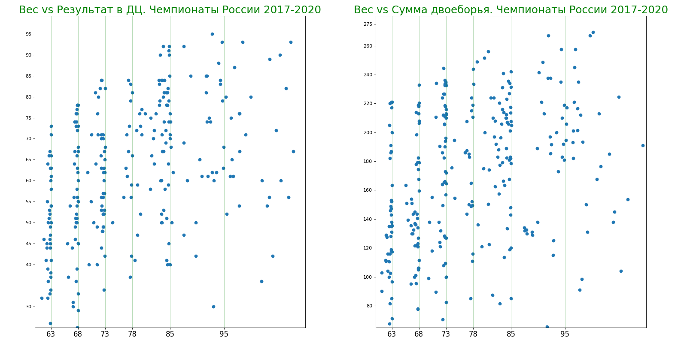
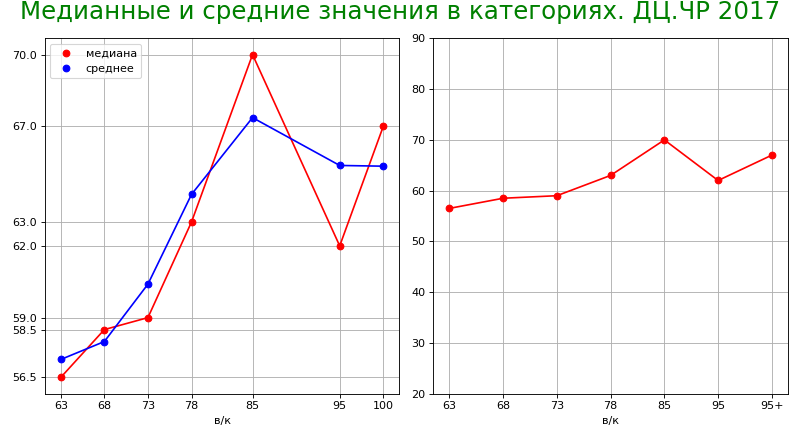
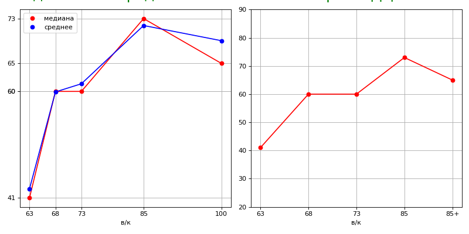
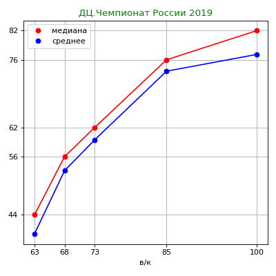
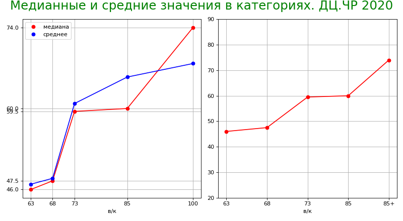
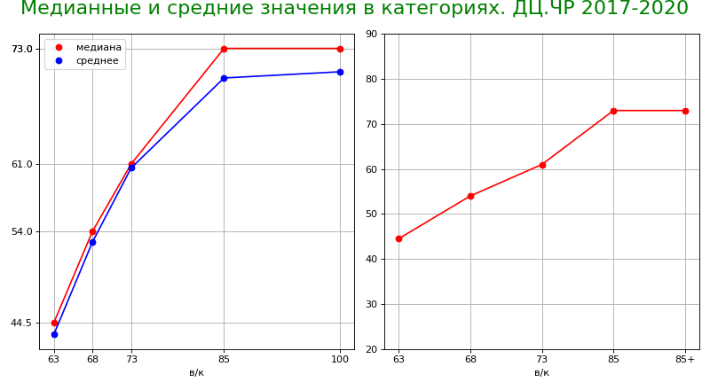
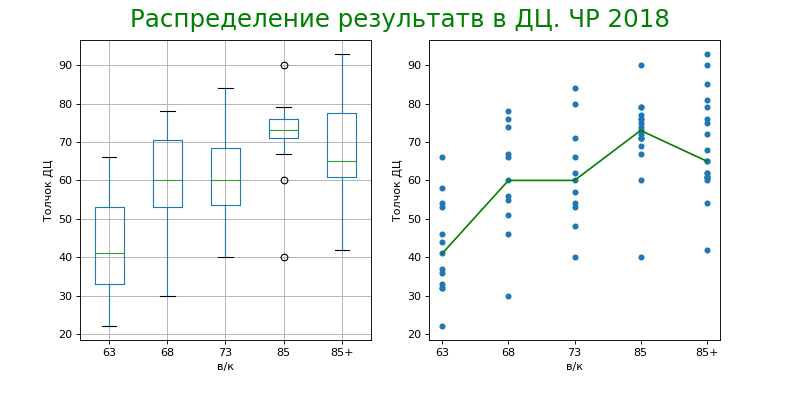
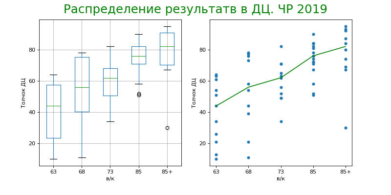
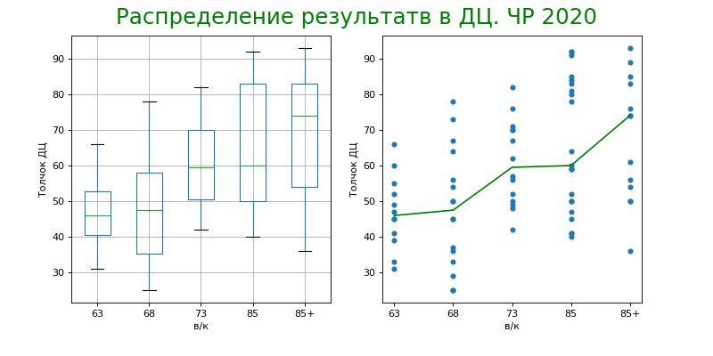
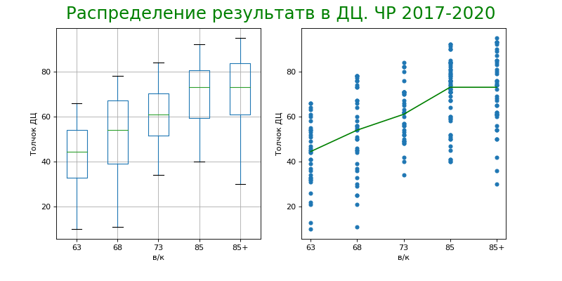

[вернуться на главную](https://alekseidudchenko.github.io/giristat/)
# Тяжелые спортсмены поднимают больше? 
# Анализ ДЦ и весовых категорий на Чемпионатах России 2017-2020 

Привет! Много дискуссий вокруг весовых категорий в гиревом спорте. Давайте попробуем посмотреть на это с разных углов, но в первую очередь - с точки зрения данных.
Здесь я анализирую данные результатов соревнований проводимых [ВФГС, Википедия](https://ru.wikipedia.org/wiki/%D0%92%D1%81%D0%B5%D1%80%D0%BE%D1%81%D1%81%D0%B8%D0%B9%D1%81%D0%BA%D0%B0%D1%8F_%D1%84%D0%B5%D0%B4%D0%B5%D1%80%D0%B0%D1%86%D0%B8%D1%8F_%D0%B3%D0%B8%D1%80%D0%B5%D0%B2%D0%BE%D0%B3%D0%BE_%D1%81%D0%BF%D0%BE%D1%80%D1%82%D0%B0 "Всероссийская федерация гиревого спорта"). Все данные взяты из протоколов с [официального сайта Федерации](https://vfgs.ru/docs/protokoly/ "vfgs.ru Протоколы соревнований").

## Поехали
В компьютеро-читаемом формате на момент написания этого материала были доступны протоколы с 2017 по 2021 (текущий) годы. Хотелось бы капнуть глубже в историю, но пока этих данных в достоверном источнике к большому сожалению нет.

Неизменно и регулярно, на ежегодной основе проводятся 
- Чемпионат России
- Первенство России среди юниоров
- Первенство России среди старших юношей
- Первенство России среди младших юношей
- Кубок России
- Чемпионат федеральных округов (азиатская часть)
- Чемпионат федеральных округов (европейская часть)

Начнем с Чемпионатов России как самых главных стартов года. 
На момент написания доступы протоколы 2017, 2018, 2019, 2020 годов.

## Вес vs Результат
Посмотрим, есть ли зависимость между собственным весом спортсмена на момент взвешивания и его результатом. Будем рассматривать Длинный цикл и Двоеборье отдельно.

Первое, что мы видим это сгустки точек вдоль линий, которые соответствуют весовым категориям. В особенности категориям 63, 68 и 73. Причем точки выстраиваются не просто вдоль линий, а именно слева от них. Это еще лучше видно на следующем графике. Действительно, мы с вами знаем как часто спортсмены тренируются в весе больше соревновательного и часто перед самым взвешиванием  интенсивно сбрасывают его, чтобы войти в категорию. 

Посмотрите на рисунок снизу. Мы никогда не встретим спортсмена с весом 63,100 или даже 64. То есть спортсмены своим поведением демонстрируют свою сильную веру в два убеждения. Первое: Больший вес дает преимущество (в разумных пределах конечно) Второе: в категории "ниже" больше шансов (опять же с кучей оговорок и ограничений). То есть если у тебя вес 64 нужно срочно или его увеличить до 68 и поднимать больше или сбросить до 63 и тоже поднимать больше. Естественно поднимать больше - это всегда главное.

  *да, в протоколах есть запись, где спортсмен выступал в категории 85+, при собственном весе 74.55. Скорее всего это банальная очепятка. 

Описанная выше закономерность не работает в категориях 78 и 85. Это объясняется очень просто. Данные графика это ЧР с 2017 по 2020. 2017 - это последний год, где категория 78 была представлена. Так же как и категория 95. 
В категории свыше 85 совсем ничего не понятно. В этом отношении интересно было бы посмотреть данные до 2017 года, особенно за те года когда еще была категория 105. Напишите мне, если у вас есть эти данные.

## Средние и медианные значения

Допустим, первые два графика совсем не убедительны в ответе на вопрос есть ли корреляция между весом и результатом. Другими словами пока не ясно, оправданно ли наличие 5 весовых категорий и нужно ли сокращать их еще.
Тогда обратимся к средним и медианным значениям. Думаю все помнят про среднюю температуру по больнице или среднюю зарплату в России, поэтому предлагаю ориентироваться на медианы (обозначены красным). Однако найдем для каждой категории и то и другое.  

Поскольку, как я уже упомянул, после 2017 действует новый ЕСВК и другое количество категорий, будем стоить графики отдельно по годам.

### 2017

Здесь и далее на графиках слева:
 * категории 95+ и 85+ обозначены как 100 
 * по оси Х отложены весовые категории в масштабе. Это тоже несет в себе информацию, потому что между 63 и 68 "расстояние" меньше чем между 85 и 95. Это важно, но графики воспринимать проще, если мы пренебрежем этим масштабом (см. графики справа)
График справа фактически это то же самое что нарисовано красной линией слева. Можете проверить значения. Разница лишь в том, 1) что "расстояние" между категориями теперь одинаковое; 2) график сильно уменьшен, как будто колёсико мышки покрутили назад и мы теперь смотрим на него издалека (обратите внимание на отметки по оси Y).  

### 2018

### 2019

### 2020 

### 2018-2020
Ни и давайте построим такую же диаграмму для последних трех лет вместе.

Мне кажется, последний график выглядит идеально.

## Усложним 
Если здесь все верно, то вопрос можно закрывать. Корреляция между категориями на лицо. В каждой следующей категории медиана результатов в ДЦ выше чем в предыдущей. Идеально. Ну кроме категории 85+.

Однако, если позанудствовать, то можно вспомнить про выбросы - значения которые сильно выбиваются из распределения. Ну например, кто-то поставил гири через 2 минуты - передумал. Допустим, у него результат 5 подъемов, а остальные в его категории подняли от 34 до 60. Нужно ли этот результат в 5 подъемов учитывать. 
По секрету, медиана робастна к выбросам. Поэтому она и имеет преимущество перед средним. Но статика существует не первый год и там есть инструменты поинтереснее чем медиана и среднее. Давайте разберем один из них. 

[Диаграмма размаха](https://ru.wikipedia.org/wiki/%D0%AF%D1%89%D0%B8%D0%BA_%D1%81_%D1%83%D1%81%D0%B0%D0%BC%D0%B8 "wiki") показывает сразу медиану, нижний и верхний квартили, минимальное и максимальное значение выборки и выбросы если они есть. 

### 2017

Здесь слева - та самая диаграмма размаха, а справа - результаты, сгруппированные по категориям и их медианы. Этот график отличается от самого первого на странице тем, что здесь мы отбрасываем информацию о весе и вместо этого используем информацию о весовых категориях.
На левом рисунке результаты так же сгруппированы по весу и медианы тоже показаны. Медианы - это зелёные полоски в середине прямоугольников. Значения у них естественно те же что и справа. Фактически эти два графика показывают одни и те же данные, просто в разной форме.
Риски на диаграмме размаха это максимальный и минимальный результат в категории. Эти риски ещё называют усами, а диаграмму - ящик с усами. Легко запомнить. От нижней риски до начала прямоугольника - "нижние" 25% всех результатов. От верхнего края прямоугольника до верхней риски - "верхние" 25%. Если ваш результат в этой зоне - выше прямоугольника - вы в первой четверти лучших спортсменов этой категории. Внутри прямоугольника - "средние" 50% результатов. 

Посмотрим для остальных годов.
### 2018

### 2019

### 2020 

### 2018-2020
Ни и давайте построим такую же диаграмму для последних трех лет вместе.

Здесь, кстати, хорошо видно преимущество ящиков с усами пред простым отображением точек. Когда точек становится слишком много, сложно что-то разглядеть.

[вернуться на главную](https://alekseidudchenko.github.io/giristat/)